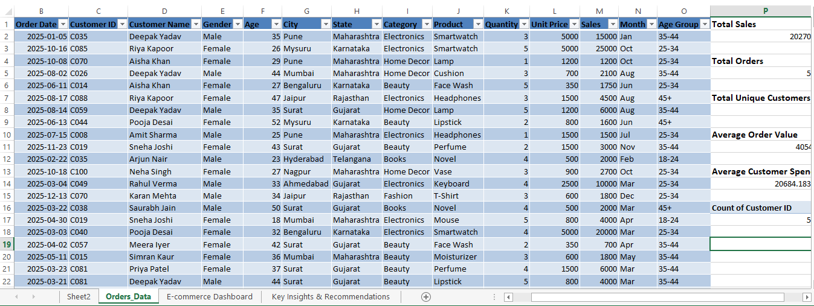

# 🛒 E-Commerce Customer Analysis Dashboard Using Excel

## 📌 Project Overview
Evaluated customer behavior, sales trends, repeat purchases, average order value, and category-wise performance.

## 🎯 Business Objective

To analyze customer transactions and sales data to identify high-value customers, profitable product categories, sales trends, and customer retention opportunities.

---

## 🛠 Tools & Technologies

- Microsoft Excel
- Pivot Tables
- Pivot Charts
- Slicers
- Conditional Formatting
- Excel Formulas
- KPI Calculations

---

## 📂 Dataset

The dataset contains:
- Order ID
- Order Date
- Customer ID
- Customer Name
- Gender
- Age
- City
- State
- Category
- Product
- Quantity
- Unit Price
- Sales
- Month
- Age Group
---

## 📊 Dashboard KPIs

- Total Sales
- Total Orders
- Total Unique Customers
- New Customers
- Repeat Customers
- Repeat Customer Rate
- Average Order Value

---

## 📈 Dashboard Features

- Monthly Sales Trend
- Category-wise Sales
- State-wise Sales
- Gender-wise Sales
- Age Group Analysis
- City-wise Sales
- Product Performance
- Top 10 Customers
- Top Repeat Customers
- New vs Repeat Customers
- Interactive Filters using Slicers

---

## 🔍 Key Insights

-  Out of 98 unique customers, 95 are repeat customers and only 3 are new customers.
- Sales increase during November month.
- Electronics category contributes the highest revenue among all categories.
- Maharashtra and Karnataka are the top-performing states.
- Sales contribution is relatively balanced across genders.
- Customers aged 35–44 generated ₹592,650, the highest among all age groups.
- Ahmedabad is the Top Performing City
- Smartwatch sales significantly outperform most other products.

---

## 💡 Recommendations

- Increase digital marketing campaigns, referral programs, and promotional offers to attract new customers.
- Focus marketing campaigns on the 18 – 34 age group. Use personalized email and social media campaigns for these customers.
- Delhi and Rajasthan generate lower revenue. Run region-specific promotions and advertising campaigns.
- Provide special rewards for top customers.
- Promote Best-Selling Products
- Improve Female Customer Engagement.
- Set a target to increase new customers from 3 to at least 15–20% of total customers.
---

## 📷 Dashboard Preview
### E-commerce Dashboard

### pivot tables

### dataset

---

## 📁 Files Included

- E-Commerce Customer Analysis Dashboard.xlsx
- Orders_Data.xlsx
- E-commerce Dashboard.png
- pivot tables.png
- dataset.png

---

## 👩‍💻 Author

**Sayali Takale**

LinkedIn: https://www.linkedin.com/in/sayali-takale-data-analyst

GitHub: https://github.com/sayalitakale1234
